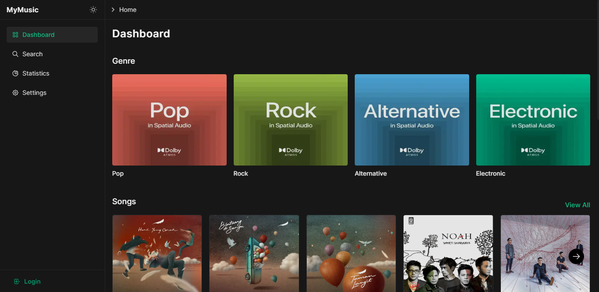

import Image from "next/image";
import { Callout } from 'nextra-theme-docs';
import Badge from "@components/Badge";
import demo from "@public/demo.png";

# MDX Component

## Heading

```html filename="index.mdx" copy
<h1>**Hello**, This Is a _Title_ Inside `h1`</h1>
{/* using html tag to avoid being rendered in the sidebar */}
```

<h1>**Hello**, This Is a _Title_ Inside `h1`</h1>

```html filename="index.mdx" copy
<h2>**Hello**, This Is a _Title_ Inside `h2`</h2>
{/* using html tag to avoid being rendered in the sidebar */}
```

<h2>**Hello**, This Is a _Title_ Inside `h2`</h2>

```markdown filename="index.mdx" copy
### **Hello**, This Is a _Title_ Inside `h3`
```

<h3>**Hello**, This Is a _Title_ Inside `h3`</h3>

```markdown filename="index.mdx" copy
#### **Hello**, This Is a _Title_ Inside `h4`
```

<h4>**Hello**, This Is a _Title_ Inside `h4`</h4>

```markdown filename="index.mdx" copy
##### **Hello**, This Is a _Title_ Inside `h5`
```

<h5>**Hello**, This Is a _Title_ Inside `h5`</h5>

```markdown filename="index.mdx" copy
###### **Hello**, This Is a _Title_ Inside `h6`
```

<h6>**Hello**, This Is a _Title_ Inside `h6`</h6>

## Text

```markdown filename="index.mdx" copy
With Nextra, all your `.md` and `.mdx` files under the pages directory will be rendered with [MDX](https://mdxjs.com/about), it's an
advanced Markdown format with React component support.
```

With Nextra, all your `.md` and `.mdx` files under the pages directory will be rendered with [MDX](https://mdxjs.com/about), it's an
advanced Markdown format with React component support.

## Text Variant

```markdown filename="index.mdx" copy
**bold**
__bold__
```

**bold**

```markdown filename="index.mdx" copy
**_italicized bold_**
***italicized bold***
___italicized bold___
```

**_italicized bold_**

```markdown filename="index.mdx" copy
_italicized_
*italicized*
```

_italicized_

```markdown filename="index.mdx" copy
~~strikethrough.~~
```

~~strikethrough.~~

## Emoji ⛺

[Emoji Docs](https://emojipedia.org/) 😂

⚠️ ⛔ ✅ ☑️ ✔️ ❌ 🚀 ⏱️ 💻 📁 🔒 🛠️ 📢 🔔 💡 📓 📆 🌄 🌇 🌍 🌒 ⚡ ❄️ 🔥 ⭐☀️

## Line Separator

```markdown filename="index.mdx" copy
---
***
```

---

## Image

**External URL :**

```markdown filename="index.mdx" copy

```


**Static Image URL :**

If the `demo.png` file is located at `/public/demo.png`, you can use the code below to display it:

```markdown filename="index.mdx" copy

```


**Static Next/Image :**

You can use [Next.js Image](https://nextjs.org/docs/basic-features/image-optimization) directly in MDX.

If the `demo.png` file is located at `/public/demo.png`, you can use the code below to display it:

```js filename="index.mdx" copy
import Image from "next/image";

<Image src="/demo.png" alt="Hello" className="rounded-lg" width={500} height={300} />;
```

<Image src="/demo.png" alt="Hello" className="rounded-lg" width={500} height={300} />

## Link

### Autolink literals

```markdown filename="index.mdx" copy
www.example.com, https://example.com, and contact@example.com.
```

www.example.com, https://example.com, and contact@example.com.

```markdown filename="index.mdx" copy
[MDX](https://mdxjs.com/about), it's an external link
```

[MDX](https://mdxjs.com/about), it's an external link

```markdown filename="index.mdx" copy
[Index](/), it's an internal link
```

[Index](/), it's an internal link

You can optionally add a title for a link. This will appear as a tooltip when the user hovers over the link. To add a title, enclose it in quotation marks after the URL.

```markdown filename="index.mdx" copy
[MDX](https://mdxjs.com/about "MDX Documentation"), Documentation
```

[MDX](https://mdxjs.com/about "MDX Documentation"), Documentation

## List

```markdown filename="index.mdx" copy
1. one
2. two
3. three
```

1. one
2. two
3. three

```markdown filename="index.mdx" copy
1. First item
2. Second item
3. Third item
    1. Indented item
    2. Indented item
4. Fourth item
```

1. First item
2. Second item
3. Third item
    1. Indented item
    2. Indented item
4. Fourth item

```markdown filename="index.mdx" copy
- one
- two
- three
```

- one
- two
- three

```markdown filename="index.mdx" copy
- First item
- Second item
- Third item
    - Indented item
    - Indented item
- Fourth item
```

- First item
- Second item
- Third item
    - Indented item
    - Indented item
- Fourth item

```markdown filename="index.mdx" copy
1. First item
2. Second item
3. Third item
    - Indented item
    - Indented item
4. Fourth item
```

1. First item
2. Second item
3. Third item
    - Indented item
    - Indented item
4. Fourth item

```markdown filename="index.mdx" copy
* asterisks for unordered items
1. decimals and a dot for ordered items
```

* asterisks for unordered items
1. decimals and a dot for ordered items

```markdown filename="index.mdx" copy
* Next
  * docs
- Next
  - docs
+ Next
  + docs
```

* Next
  * docs
- Next
  - docs
+ Next
  + docs
	
## Task List

```markdown filename="index.mdx" copy
- [x] Write the press release
- [ ] Update the website
- [ ] Contact the media
```

- [x] Write the press release
- [ ] Update the website
- [ ] Contact the media

## Syntax Highlighting

Automatically syntax highlighting:

````markdown filename="index.mdx" copy
```js filename="index.mdx" copy
console.log("hello, world");
```
````

Renders:

```js filename="index.mdx" copy
console.log("hello, world");
```

### Inlined Code

```markdown filename="index.mdx" copy
You can use \`content\` to wrap inline code content like: `let x = 1`.
```

You can use \`content\` to wrap inline code content like: `let x = 1`.

Inlined syntax highlighting like `let x = 1{:jsx}` is also supported via the `{:}` syntax:

````md filename="Markdown"
Inlined syntax highlighting is also supported `let x = 1{:jsx}` via:
````

### Highlighting Lines

You can also add the `{line number, line number-line number}` modifier to highlight specific lines:

````markdown filename="index.mdx" copy
```jsx filename="index.mdx" {4, 7-8}
import useSWR from "swr";

function Profile() {
	const { data, error } = useSWR("/api/user", fetcher);

	if (error) return <div>failed to load</div>;
	if (!data) return <div>loading...</div>;
	return <div>hello {data.name}!</div>;
}
```
````

```jsx filename="index.mdx" {4, 7-8} copy
import useSWR from "swr";

function Profile() {
	const { data, error } = useSWR("/api/user", fetcher);

	if (error) return <div>failed to load</div>;
	if (!data) return <div>loading...</div>;
	return <div>hello {data.name}!</div>;
}
```

### Highlighting Substrings

You can highlight specific substrings of code by adding a `//` attribute to the code block:

````md filename="Markdown" copy
```js /useState/
import { useState } from 'react'

function Counter() {
  const [count, setCount] = useState(0)
  return <button onClick={() => setCount(count + 1)}>{count}</button>
}
```
````

```js /useState/ copy
import { useState } from 'react'

function Counter() {
  const [count, setCount] = useState(0)
  return <button onClick={() => setCount(count + 1)}>{count}</button>
}
```

You can highlight only a part of the occurrences of that substring by adding a number it: `/str/1`, or multiple: `/str/1-3`, `/str/1,3`.

### Line Numbers

You can add line numbers to your code blocks by adding a `showLineNumbers` attribute:

````md filename="Markdown" copy
```js showLineNumbers
import { useState } from 'react'

function Counter() {
  const [count, setCount] = useState(0)
  return <button onClick={() => setCount(count + 1)}>{count}</button>
}
```
````

Renders:

```js showLineNumbers copy
import { useState } from 'react'

function Counter() {
  const [count, setCount] = useState(0)
  return <button onClick={() => setCount(count + 1)}>{count}</button>
}
```

### Copy Button

By adding a copy attribute, a copy button will be added to the code block when the user hovers over it:

````md copy
```js copy
console.log('hello, world')
```
````

```js copy
console.log('hello, world')
```

## Diff Code

````markdown filename="index.mdx" copy
```diff filename="index.mdx"
- import { useSWRInfinite } from 'swr'
+ import useSWRInfinite from 'swr/infinite'
```
````

```diff filename="index.mdx" copy
- import { useSWRInfinite } from 'swr'
+ import useSWRInfinite from 'swr/infinite'
```

## Blockquote

```markdown filename="index.mdx" copy
> Where some people measure progress in answers-right per test or tests-passed per year, we are more interested in Sistine-Chapel-Ceilings per Lifetime.
>
> — Alan Kay, A Personal Computer for Children of All Ages
```

> Where some people measure progress in answers-right per test or tests-passed per year, we are more interested in Sistine-Chapel-Ceilings per Lifetime.
>
> — Alan Kay, A Personal Computer for Children of All Ages

Nested quotes:

```markdown filename="index.mdx" copy
> > Where some people measure progress in answers-right per test or tests-passed per year, we are more interested in Sistine-Chapel-Ceilings per Lifetime.
> >
> > — Alan Kay, A Personal Computer for Children of All Ages
>
> This is **great**.
>
> — Shu Ding.
```

> > Where some people measure progress in answers-right per test or tests-passed per year, we are more interested in Sistine-Chapel-Ceilings per Lifetime.
> >
> > — Alan Kay, A Personal Computer for Children of All Ages
>
> This is **great**.
>
> — Shu Ding.

## Table

```jsx filename="index.mdx" copy
| Left | Center | Right |
| :--- | :----: | ----: |
| Left-aligned | Center-aligned | Right-aligned |
```

| Left | Center | Right |
| :--- | :----: | ----: |
| Left-aligned | Center-aligned | Right-aligned |

```jsx filename="index.mdx" copy
| Syntax        | Description |   Test Text |
| :-----------  | :---------: | --------:   |
| Header        |    Title    | Here's this |
| Paragraph	    |    Text     |   And more  |
| Strikethrough |             |   ~~Text~~  |
```

| Syntax        | Description |   Test Text |
| :------------ | :---------: | ----------: |
| Header        |    Title    | Here's this |
| Paragraph     |    Text     |    And more |
| Strikethrough |             |    ~~Text~~ |

```jsx filename="index.mdx" copy
| Badge | Description | Code | Icon |
| :- | :-: | :-: | -: |
| <Badge>Default</Badge> | Default | <span className="font-semibold text-blue-500">100</span> | ☑️ |
| <Badge variant="success">Success</Badge> | Success | <span className="font-semibold text-green-500">200</span> | ✅ |
| <Badge variant="info">Warning</Badge> | Warning | <span className="font-semibold text-orange-500">400</span> | ⚠️ |
| <Badge variant="danger">Danger</Badge> | Danger | <span className="font-semibold text-red-500">500</span> | ⛔ |
```

| Badge                                    | Description |                                                       Code | Icon |
| :--------------------------------------- | :---------: | ---------------------------------------------------------: | ---: |
| <Badge>Default</Badge>                   |   Default   |   <span className="font-semibold text-blue-500">100</span> |   ☑️ |
| <Badge variant="success">Success</Badge> |   Success   |  <span className="font-semibold text-green-500">200</span> |   ✅ |
| <Badge variant="info">Warning</Badge>    |   Warning   | <span className="font-semibold text-orange-500">400</span> |   ⚠️ |
| <Badge variant="danger">Danger</Badge>   |   Danger    |    <span className="font-semibold text-red-500">500</span> |   ⛔ |

## React Components

React components and Markdown can be **mixed together**, for instance:

### Default

<Callout emoji="👾">
	**Space Invaders** is a 1978 shoot 'em up arcade game developed by Tomohiro
	Nishikado.
</Callout>

```mdx filename="index.mdx" copy
import Callout from "nextra-theme-docs/callout";

<Callout emoji="👾">
	**Space Invaders** is a 1978 shoot 'em up arcade game developed by Tomohiro
	Nishikado.
</Callout>
```

### Warning

<Callout type="warning" emoji="⚠️">
	This API will be deprecated soon.
</Callout>

```mdx filename="index.mdx" copy
import Callout from "nextra-theme-docs/callout";

<Callout type="warning" emoji="⚠️">
	This API will be deprecated soon.
</Callout>
```

### Error

<Callout type="error" emoji="🚫">
	This is a dangerous feature that can cause everything to explode.
</Callout>

```mdx filename="index.mdx" copy
import Callout from "nextra-theme-docs/callout";

<Callout type="error" emoji="️🚫">
	This is a dangerous feature that can cause everything to explode.
</Callout>
```

```html filename="index.mdx" copy
>
<Callout>
	> Give [**Next Docs**](https://github.com/wahidari/next-docs-v2) a star! >
</Callout>
```

Renders:

> <Callout>
> 	Give [**Next Docs**](https://github.com/wahidari/next-docs-v2) a star!
> </Callout>

## Embed Iframe

```jsx filename="index.mdx" copy
<iframe
	width="100%"
	height="430"
	src="https://www.youtube.com/embed/3hccXiXI0u8"
	frameBorder="0"
	allow="accelerometer; autoplay; clipboard-write; encrypted-media; gyroscope; picture-in-picture"
	allowFullScreen
/>
```

<iframe
	title="Youtube"
	width="100%"
	height="430"
	src="https://www.youtube.com/embed/3hccXiXI0u8"
	frameBorder="0"
	allow="accelerometer; autoplay; clipboard-write; encrypted-media; gyroscope; picture-in-picture"
	allowFullScreen
/>

```jsx filename="index.mdx" copy
<iframe
	src="https://codesandbox.io/embed/swr-states-4une7"
	width="100%"
	height="500px"
	title="SWR-States"
></iframe>
```

<iframe
	src="https://codesandbox.io/embed/swr-states-4une7"
	width="100%"
	height="500px"
	title="SWR-States"
></iframe>

## Footnote

A note[^1]

Here's a simple footnote,[^2] and here's a longer one.[^bignote]

---

[^1]: Big note.

[^2]: This is the simple footnote.

[^bignote]: Here's one with multiple paragraphs and code.

    Indent paragraphs to include them in the footnote.

    `{ my code }`

    Add as many paragraphs as you like.