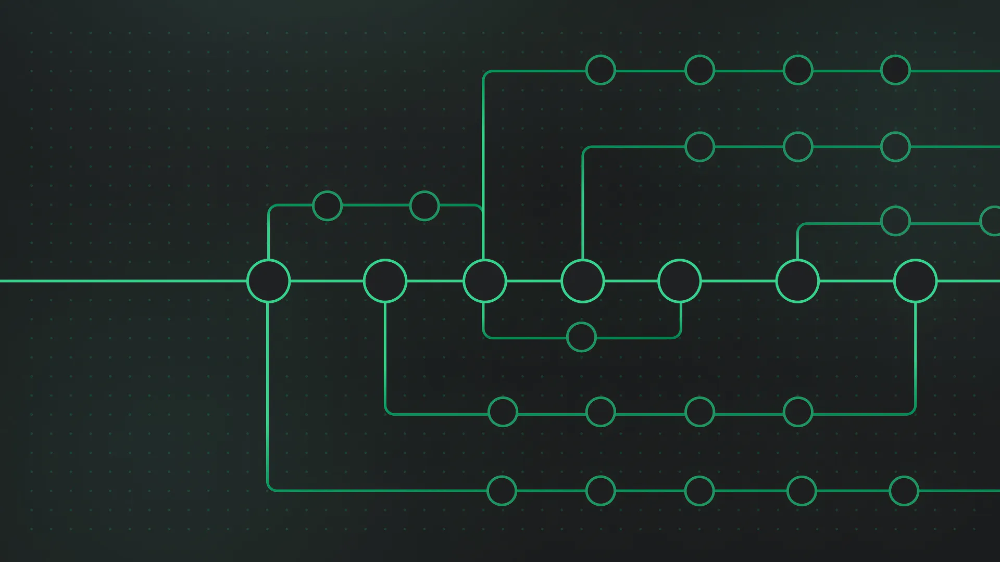
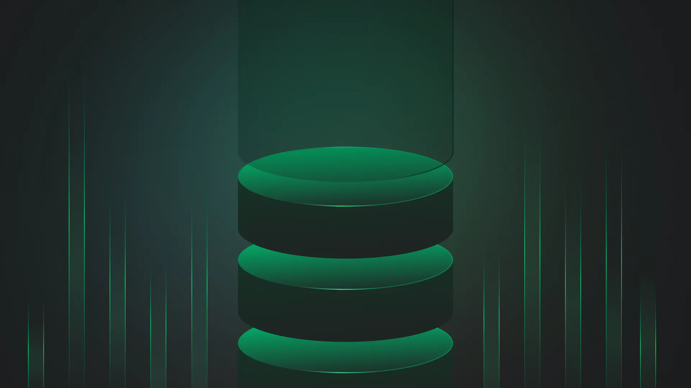

import { Card, Cards } from "@components/cards";
import { Callout, Tab, Tabs } from 'nextra-theme-docs';

# Introduction

Welcome to Nextra! This is a basic docs template. You can use it as a starting point for your own project :)

## What is Nextra?

A **simple**, **powerful** and **flexible** site generation framework with everything you love from Next.js.

## Features

To start using Nextra, you need to select a theme first:

<Cards num={2}>
  <Card
    image
    arrow
    title="Documentation theme"
    href="/docs/#">
    <></>
  </Card>
  <Card
    image
    arrow
    title="Blog theme"
    href="/docs/#">
    <></>
  </Card>
</Cards>

## Documentation

The documentation is available at [https://nextra.site](https://nextra.site).

<Cards>
	<Card
		icon={
			<svg
				xmlns="http://www.w3.org/2000/svg"
				fill="none"
				viewBox="0 0 24 24"
				strokeWidth={1.5}
				stroke="currentColor"
				className="w-6 h-6"
			>
				<path
					strokeLinecap="round"
					strokeLinejoin="round"
					d="M15.75 17.25v3.375c0 .621-.504 1.125-1.125 1.125h-9.75a1.125 1.125 0 01-1.125-1.125V7.875c0-.621.504-1.125 1.125-1.125H6.75a9.06 9.06 0 011.5.124m7.5 10.376h3.375c.621 0 1.125-.504 1.125-1.125V11.25c0-4.46-3.243-8.161-7.5-8.876a9.06 9.06 0 00-1.5-.124H9.375c-.621 0-1.125.504-1.125 1.125v3.5m7.5 10.375H9.375a1.125 1.125 0 01-1.125-1.125v-9.25m12 6.625v-1.875a3.375 3.375 0 00-3.375-3.375h-1.5a1.125 1.125 0 01-1.125-1.125v-1.5a3.375 3.375 0 00-3.375-3.375H9.75"
				/>
			</svg>
		}
		title="Organize Files"
		href="/docs/#"
	/>
	<Card
		icon={
			<svg
				xmlns="http://www.w3.org/2000/svg"
				fill="none"
				viewBox="0 0 24 24"
				strokeWidth={1.5}
				stroke="currentColor"
				className="w-6 h-6"
			>
				<path
					strokeLinecap="round"
					strokeLinejoin="round"
					d="M9.813 15.904L9 18.75l-.813-2.846a4.5 4.5 0 00-3.09-3.09L2.25 12l2.846-.813a4.5 4.5 0 003.09-3.09L9 5.25l.813 2.846a4.5 4.5 0 003.09 3.09L15.75 12l-2.846.813a4.5 4.5 0 00-3.09 3.09zM18.259 8.715L18 9.75l-.259-1.035a3.375 3.375 0 00-2.455-2.456L14.25 6l1.036-.259a3.375 3.375 0 002.455-2.456L18 2.25l.259 1.035a3.375 3.375 0 002.456 2.456L21.75 6l-1.035.259a3.375 3.375 0 00-2.456 2.456zM16.894 20.567L16.5 21.75l-.394-1.183a2.25 2.25 0 00-1.423-1.423L13.5 18.75l1.183-.394a2.25 2.25 0 001.423-1.423l.394-1.183.394 1.183a2.25 2.25 0 001.423 1.423l1.183.394-1.183.394a2.25 2.25 0 00-1.423 1.423z"
				/>
			</svg>
		}
		title="Syntax Highlighting"
		href="/docs/#"
	/>
	<Card
		icon={
			<svg
				xmlns="http://www.w3.org/2000/svg"
				viewBox="0 0 24 24"
				fill="currentColor"
				className="w-6 h-6"
			>
				<path
					fillRule="evenodd"
					d="M14.615 1.595a.75.75 0 01.359.852L12.982 9.75h7.268a.75.75 0 01.548 1.262l-10.5 11.25a.75.75 0 01-1.272-.71l1.992-7.302H3.75a.75.75 0 01-.548-1.262l10.5-11.25a.75.75 0 01.913-.143z"
					clipRule="evenodd"
				/>
			</svg>
		}
		title="Next.js SSG"
		href="/docs/#"
	/>
	<Card
		icon={
			<svg
				xmlns="http://www.w3.org/2000/svg"
				fill="none"
				viewBox="0 0 24 24"
				strokeWidth={1.5}
				stroke="currentColor"
				className="w-6 h-6"
			>
				<path
					strokeLinecap="round"
					strokeLinejoin="round"
					d="M2.25 15.75l5.159-5.159a2.25 2.25 0 013.182 0l5.159 5.159m-1.5-1.5l1.409-1.409a2.25 2.25 0 013.182 0l2.909 2.909m-18 3.75h16.5a1.5 1.5 0 001.5-1.5V6a1.5 1.5 0 00-1.5-1.5H3.75A1.5 1.5 0 002.25 6v12a1.5 1.5 0 001.5 1.5zm10.5-11.25h.008v.008h-.008V8.25zm.375 0a.375.375 0 11-.75 0 .375.375 0 01.75 0z"
				/>
			</svg>
		}
		title="Next.js Image"
		href="/docs/#"
	/>
</Cards>

<Cards>
	<Card
		icon={
			<svg
				xmlns="http://www.w3.org/2000/svg"
				fill="none"
				viewBox="0 0 24 24"
				strokeWidth={1.5}
				stroke="currentColor"
				className="w-6 h-6"
			>
				<path
					strokeLinecap="round"
					strokeLinejoin="round"
					d="M12 7.5h1.5m-1.5 3h1.5m-7.5 3h7.5m-7.5 3h7.5m3-9h3.375c.621 0 1.125.504 1.125 1.125V18a2.25 2.25 0 01-2.25 2.25M16.5 7.5V18a2.25 2.25 0 002.25 2.25M16.5 7.5V4.875c0-.621-.504-1.125-1.125-1.125H4.125C3.504 3.75 3 4.254 3 4.875V18a2.25 2.25 0 002.25 2.25h13.5M6 7.5h3v3H6v-3z"
				/>
			</svg>
		}
		title="Docs Theme →"
		href="/docs/#"
	/>
	<Card
		icon={
			<svg
				xmlns="http://www.w3.org/2000/svg"
				fill="none"
				viewBox="0 0 24 24"
				strokeWidth={1.5}
				stroke="currentColor"
				className="w-6 h-6"
			>
				<path
					strokeLinecap="round"
					strokeLinejoin="round"
					d="M19.5 14.25v-2.625a3.375 3.375 0 00-3.375-3.375h-1.5A1.125 1.125 0 0113.5 7.125v-1.5a3.375 3.375 0 00-3.375-3.375H8.25m0 12.75h7.5m-7.5 3H12M10.5 2.25H5.625c-.621 0-1.125.504-1.125 1.125v17.25c0 .621.504 1.125 1.125 1.125h12.75c.621 0 1.125-.504 1.125-1.125V11.25a9 9 0 00-9-9z"
				/>
			</svg>
		}
		title="Blog Theme →"
		href="/docs/#"
	/>
</Cards>

## Start as New Project

<div className="steps-container">

### Install

To create a Nextra Docs site manually, you have to install **Next.js**, **React**, **Nextra**, and **Nextra Docs Theme**. In your project directory, run the following command to install the dependencies:

<Tabs items={['pnpm', 'npm', 'yarn']}>
  <Tab>
    ```bash
    pnpm i next react react-dom nextra nextra-theme-docs
    ```
  </Tab>
  <Tab>
    ```bash
    npm i next react react-dom nextra nextra-theme-docs
    ```
  </Tab>
  <Tab>
    ```bash
    yarn add next react react-dom nextra nextra-theme-docs
    ```
  </Tab>
</Tabs>

<Callout>
  If you already have Next.js installed in your project, you only need to install `nextra` and `nextra-theme-docs` as the add-ons.
</Callout>

### Add Next.js Config

Create the following `next.config.js` file in your project’s root directory:

```js filename="next.config.js"
const withNextra = require('nextra')({
  theme: 'nextra-theme-docs',
  themeConfig: './theme.config.jsx',
})

module.exports = withNextra()

// If you have other Next.js configurations, you can pass them as the parameter:
// module.exports = withNextra({ /* other next.js config */ })
```

With the above configuration, Nextra can handle Markdown files in your Next.js project, with the specified theme. Other Nextra configurations can be found in [Guide](/docs/guide).

### Create Docs Theme Config

Lastly, create the corresponding `theme.config.jsx` file in your project’s root directory. This will be used to configure the Nextra Docs theme:

```jsx filename="theme.config.jsx"
export default {
  logo: <span>My Nextra Documentation</span>,
  project: {
    link: 'https://github.com/shuding/nextra',
  },
  // ...
}
```

Full theme configurations can be found [here](/docs/#).

### Ready to Go!

Now, you can create your first MDX page as `pages/index.mdx`:

```mdx filename="pages/index.mdx"
# Welcome to Nextra

Hello, world!
```

And run the `pnpm next` command to start developing the project! 🎉
</div>